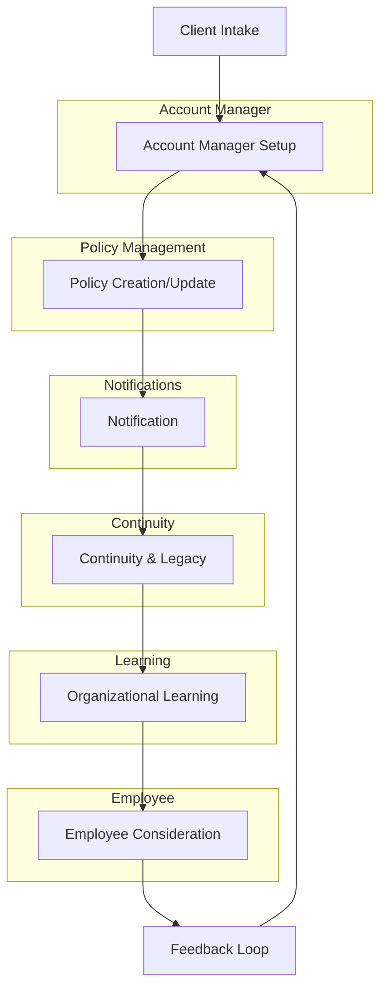

# Root & Evergreen Operational Workflows

# Root & Evergreen Operational Workflows

## 1. Client Intake Workflow
- Collect basic company info (size, structure, current policies, pain points).
- Send welcome packet and service agreement.
- Assign dedicated account manager.
- Schedule onboarding session.

## 2. Account Manager Workflow
- Review new client’s background and intake notes.
- Set up client profile and shared communication channel (e.g., Slack, Teams).
- Schedule regular check-ins (weekly/biweekly).
- Use AI tools to surface relevant resources, templates, and compliance reminders.
- Track client requests, open items, and follow-ups in a simple CRM or shared doc.
- Document all interactions for continuity.

## 3. Policy Creation/Update Workflow
- Account manager consults with client to identify policy needs or changes.
- Use AI to draft policy templates tailored to client’s context.
- Review draft with client for feedback and customization.
- Finalize policy and obtain client approval.
- Store policy in a shared, organized repository (e.g., Google Drive, Notion).
- Communicate updates to relevant employees and stakeholders.

## 4. Notification Workflow
- Automated reminders for policy reviews, compliance deadlines, and key events.
- Account manager receives AI-generated alerts for follow-ups and expiring documents.
- Clients and employees notified of new/updated policies via email or preferred channel.
- Maintain a notification log for accountability.

## 5. Continuity & Legacy Workflow
- Centralize all policies, procedures, and key documents in an organized repository.
- Maintain a “continuity file” with critical knowledge, decisions, and rationale.
- Regularly back up and audit files for completeness.
- Ensure handoff protocols for account manager transitions.
- Use AI to surface legacy knowledge for new managers or employees.

## 6. Organizational Learning Workflow
- Capture lessons learned from client engagements and internal reviews.
- Share best practices and case studies in a community knowledge base.
- Facilitate peer roundtables or discussion forums for shared learning.
- Use AI to identify trends and recommend improvements.
- Encourage feedback loops from clients and employees.

## 7. Employee Consideration Workflow
- Ensure all policies are communicated in plain language.
- Provide employees with easy access to policies and support channels.
- Offer orientation sessions for new policies or changes.
- Collect employee feedback on policies and processes.
- Use AI to monitor sentiment and flag potential issues for account managers.
